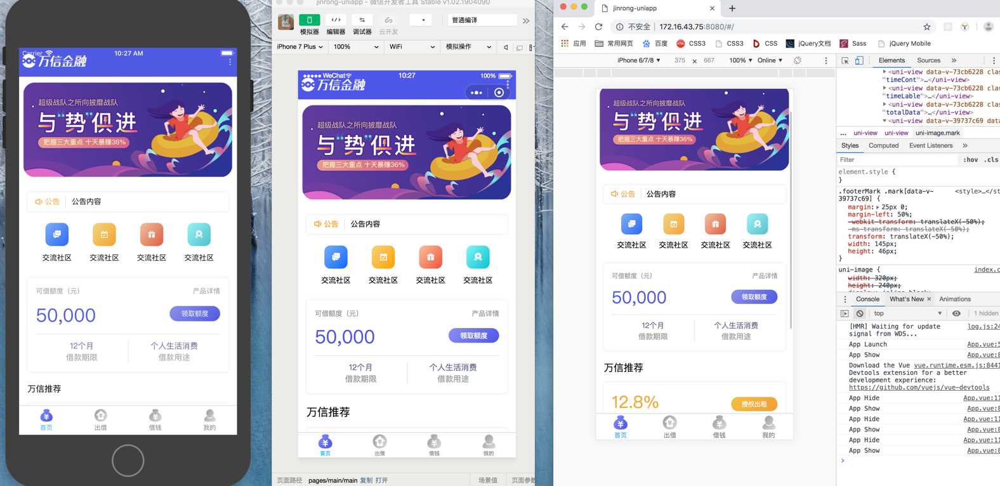

# wanxinp2p-frontend 万信金融前端工程

## 万信金融前端工程概述

### 前端APP工程（wanxinp2p-web-app）

> wanxinp2p-web-app 是万信金融项目前端APP工程，以 H5 为主，结合uni-app 的全端特性。同步实现了安卓、IOS、微信小程序的同步实现



#### 项目结构

```
┌─components            uni-app公共组件目录
│  └─comp-a.vue         可复用的a组件
├─pages                 业务页面文件存放的目录 详细内页查看pages.json
├─static                存放本应用的图片静态资源
├─utils                 公共资源存放
│  └─common.css         公用样式文件
│  └─request.js         统一请求打包文件
│  └─utils.js           公用函数打包文件
├─main.js               Vue初始化入口文件
├─App.vue               应用配置，用来配置App全局样式以及监听 应用生命周期
├─manifest.json         配置应用名称、appid、logo、版本等打包信息
└─pages.json            配置页面路由、导航条、选项卡等页面类信息
```

#### APP 项目安装使用

- 一、下载 VSCode 导入运行
- 二、通过安装脚手架，安装依赖环境
    - `npm install -g @vue/cli`
    - `vue create -p dcloudio/uni-preset-vue my-project`
    > 全局安装vue-cli，并创建uni-app，用现有项目内容替换掉新建项目的 src 文件内容即可
    - 项目启动执行命令：`npm run dev:h5`


## Git

- https://github.com/MooNkirA/wanxinp2p-project

## Project setup

```
npm install
```

### Compiles and hot-reloads for development

```
npm run serve
```

### Compiles and minifies for production

```
npm run build
```

### Customize configuration

See [Configuration Reference](https://cli.vuejs.org/config/).